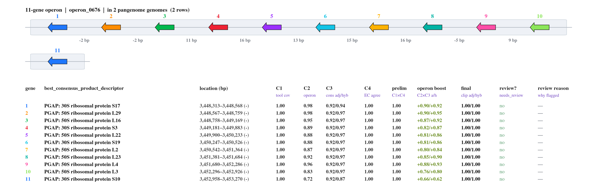

<h1 align="center">MARGIE</h1>

<p align="center">
  <b>M</b>ostly <b>A</b>utomated <b>R</b>apid <b>G</b>enome <b>I</b>nference <b>E</b>nvironment
</p>

<p align="center">
  <i>A phased prokaryotic pipeline that annotates genomes, calls operons,<br>
  and scores every gene's annotation confidence.</i>
</p>

<p align="center">
  <a href="#what-margie-does">What it does</a> &nbsp;·&nbsp;
  <a href="#how-to-run">Quickstart</a> &nbsp;·&nbsp;
  <a href="#2-configure-once">Configure</a> &nbsp;·&nbsp;
  <a href="#databases--use-the-labs-or-bring-your-own">Databases</a> &nbsp;·&nbsp;
  <a href="#running-unattended-recommended-for-real-runs">Unattended</a> &nbsp;·&nbsp;
  <a href="README-detailed.md">Full toolkit</a>
</p>

<p align="center">
  
</p>
<p align="center">
  <sub><i>Sample output — the</i> E.&nbsp;coli <i>S10 ribosomal-protein operon (11 genes, all at final confidence&nbsp;1.00), with the per-gene C1–C4 breakdown MARGIE renders beneath every operon.</i></sub>
</p>

---

## What MARGIE does

A phased [Snakemake](https://snakemake.github.io/) workflow, four stages:

<p align="center">
  <b>1. Annotate</b> &nbsp;→&nbsp; <b>2. Call operons</b> &nbsp;→&nbsp; <b>3. Score confidence (C1–C4)</b> &nbsp;→&nbsp; <b>4. Render operon figures</b>
</p>

> **Note** — stages 1–2 use already-available tools; MARGIE introduces no new
> algorithm for annotation or operon calling. It integrates those tools and
> processes their output downstream to derive confidence. 
> NOTE: "Stage" (only for readme) is different from the "Phases" the Pipeline uses.

### The name

|  |  |
|---|---|
| **Mostly Automated** | You decide what the results mean — MARGIE does not make the decisions. |
| **Rapid** | Built for large-scale prokaryotic annotation; it parallelizes across genomes, so it is best fed many at once (single-genome runs work too). |
| **Inference Environment** | MARGIE helps you *draw* inference — it does not provide decisions (yet). |

---

## How to run

> A minimal quickstart. For the broader toolkit (CLI file tools, API server,
> frontend), see **[README-detailed.md](README-detailed.md)**.

**At a glance**

```text
1. uv sync                          # build the environment
2. run dane_wf once                 # seeds ~/.config/bioinformatics-tools/config.yaml
3. edit that config                 # results DB, paths, cluster settings
4. dane_wf margie sb input: … output_dir: … run_full_operon_map: true
```

### 1. Set up the environment (once)

The pipeline runs from the repo's own uv-managed virtual environment.

```bash
git clone <github-url> ~/bioinformatics-tools
cd ~/bioinformatics-tools
uv sync            # builds .venv from the pinned lockfile — the sole pipeline env
```

This produces `~/bioinformatics-tools/.venv/bin/dane_wf`.

### 2. Configure (once)

**How the config is created:** MARGIE reads a per-user config file at
**`~/.config/bioinformatics-tools/config.yaml`**. It is **not** created by
`uv sync`. The **first** time you run any CLI command (e.g. `dane_wf …`), the app
checks for that file and, if it doesn't exist yet, creates the folder and copies
the repo template
([`bioinformatics_tools/caragols/config-template.yaml`](bioinformatics_tools/caragols/config-template.yaml))
into it. If it already exists, it's left untouched.

**This "[~/.config/bioinformatics-tools/config.yaml]" file is where you control everything MARGIE does** — the results
database, your cluster's SLURM submission settings, all container/database
paths, and any per-tool overrides. Edit it after that first run. At minimum,
set your results database and (if not using the defaults) your compute settings:

```yaml
main_database: <path-to-where-you-want-to-keep-the-db>.db
# db_root  defaults to /depot/lindems/data/margie/db  if not set
# sif_path defaults to /depot/lindems/data/margie/sif if not set
```
###### This ".db" database is important because it is where the results are cached.
###### When you rerun the pipeline on same organisms (exact same fasta file content), the results get
###### restored back--saves time!

#### Databases — use the lab's, or bring your own

Every database MARGIE reads from or writes to depot is a config key with a
`/depot/lindems/...` default. Override any of them to point at your **own**
writable location; the update steps are incremental and idempotent, so a fresh
empty path **builds itself up** as you run genomes — no lab depot required.

```yaml
operon_database:
  occ_reference_pkl: <path>/occ_reference.pkl     # operon (OCC) database
fingerprint_database:
  path: <path>/fingerprint-database.tsv           # gene fingerprint database
report_figures:
  operon_db: <path>/fingerprint-database/         # operon-fingerprint DB (figures)
genome_pool:
  path: <path>/genome-pool                        # shared genome pool (AAI/ANI)
final_tables_depot:
  path: <path>/final-tables                       # persisted FINAL tables
scoring_results_historical:
  path: <path>/scoring-results-historical         # historical scoring snapshots
sqlite_pipeline_snapshot:
  path: <path>/sqlite/pipeline-version            # pipeline-version SQLite snapshot
```

### 3. Run the pipeline

`dane_wf` is a lightweight **orchestrator** — it submits the heavy per-rule work
as separate SLURM jobs (Snakemake's slurm executor) and mostly just waits and
monitors. It must stay alive for the whole run, so keep the *orchestrator itself*
small (1 CPU / little memory) with a long wall-time; the actual compute gets its
own allocations from the settings in `config.yaml`. Run it on the login node for
a quick test, or submit it as a thin SLURM job to run unattended (see
[Running unattended](#running-unattended-recommended-for-real-runs)):

```bash
~/bioinformatics-tools/.venv/bin/dane_wf margie sb \
    input: <path to the folder holding your genome scaffolds (FASTA files)> \
    output_dir: <path to the folder where this run's results should go> \
    run_full_operon_map: true
```

- **`margie sb`** — two separate tokens, *not* `margie_sb` (the CLI dispatches
  `do_margie_sb` from the words `margie sb`). Config *keys*, however, stay
  underscored, e.g. `margie_sb.resume: true`.
- **Tokens are `key: value`** with a space after the colon.
- **`input:`** — a directory of genome FASTAs (batch) or a single FASTA.
- **`output_dir:`** — the *full* run path. The CLI does **not** append a
  timestamp (only the web UI does); give the exact folder you want.
- **`run_full_operon_map: true`** — renders the operon-diagram atlas (the arrows +
  per-operon confidence tables shown above, under
  `<genome>/scoring/figures/complete-organism-operon-diagrams/`). It is **off by
  default**; the standard per-organism report figures render regardless.
- **Depot database updates** (`occ_reference` leave-one-out + fingerprint DB in
  `/depot/lindems/data/margie/`) run automatically as the final rules — no flag
  needed.

### Running unattended (recommended for real runs)

The orchestrator must outlive every child job, so for anything bigger than a
quick test don't tie it to your SSH session. Two good options:

**A. Submit the orchestrator as a thin SLURM job** — keeps the login node clean
and survives logout:

```bash
cat > run_margie.sh <<'EOF'
#!/bin/bash
#SBATCH --job-name=margie
#SBATCH --cpus-per-task=1        # orchestrator only — compute runs in child jobs
#SBATCH --mem=4G
#SBATCH --time=48:00:00          # must outlive the whole run
#SBATCH --output=margie-%j.log
# + your cluster's usual submission directives
~/bioinformatics-tools/.venv/bin/dane_wf margie sb \
    input: <path to the folder holding your genome scaffolds (FASTA files)> \
    output_dir: <path to the folder where this run's results should go> \
    run_full_operon_map: true
EOF
sbatch run_margie.sh
```

This wrapper is tiny — the heavy per-rule jobs it spawns get their own
allocations from the compute settings in your `config.yaml`. (Requires a cluster
that allows submitting jobs from within a job — RCAC/Negishi does.)

**B. Detach it on the login node** with `tmux`/`screen`, or with `nohup`:

```bash
nohup ~/bioinformatics-tools/.venv/bin/dane_wf margie sb \
    input: <path to the folder holding your genome scaffolds (FASTA files)> \
    output_dir: <path to the folder where this run's results should go> \
    run_full_operon_map: true > margie.log 2>&1 &
```

New to this? `nohup` ("no hangup") keeps the run alive **after you log out or your
SSH connection drops** — normally, closing the terminal would kill it. The
`> margie.log 2>&1` part sends everything the run prints (progress **and** errors)
into a file called `margie.log`, and the trailing `&` puts it in the background so
you get your prompt back right away. Then:

- **watch it:** `tail -f margie.log`
- **stop it:** `pkill -f dane_wf` (or `kill <PID>`, using the PID printed when it starts)

`tmux`/`screen` do the same "survive logout" job but let you *reattach* to the live
session later — handy if you'd rather watch it scroll than tail a log file.

### Handy extras

| Task | Add to the command |
|------|--------------------|
| Resume a crashed run | `margie_sb.resume: true` (point `output_dir:` at the existing run folder) |
| Run a subset of tools | `margie_sb.selected_tools: prodigal,rast,pfam` — a comma-separated list of tool keys |

`dane_wf` is the venv console script at `~/bioinformatics-tools/.venv/bin/dane_wf`
(used in the commands above). If you activate the environment first, you can call
`dane_wf` by name instead of by full path — the arguments are identical:

```bash
source ~/bioinformatics-tools/.venv/bin/activate
dane_wf margie sb \
    input: <path to the folder holding your genome scaffolds (FASTA files)> \
    output_dir: <path to the folder where this run's results should go> \
    run_full_operon_map: true
```
